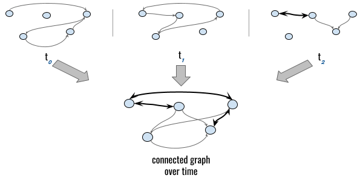
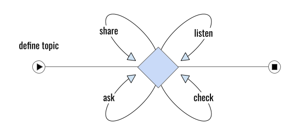
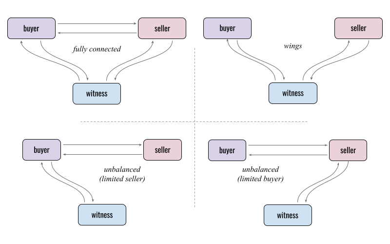

# Gossip-Oriented State SYnchronization Protocol (GOSSYP) 1.0

## Metadata
- Authors: Daniel Hardman <daniel.hardman@gmail.com>
- Status: proposed
- PIURI: https://didcomm.org/gossyp/%VER
- Tags: #gossip, #chat, #crdt, #n-wise

## Summary

Defines how to maintain a shared view of changing state, despite the complex connectivity challenges of decentralized, n-wise interactions. Since shared state can drive a workflow, we recommend [implementing n-wise DIDComm protocols atop gossyp](#building-on-gossyp); its abstraction over point-to-point communication[<a id="ref1" href="note1">1</a>] can make such protocols easier to design and impliment, and far more robust. 

>Note: Careful students of this protocol will recognize overlaps between this protocol and several other technologies in SSI and distributed systems. For an analysis of how gossyp's solution to this problem compares to other approaches, see [Appendix 1: Alternatives](#appendix-1-alternatives).

## Roles

Many [participants](https://github.com/dhh1128/didcomm-terms/wiki/participant) may run this protocol, but they all share a single role, `peer`. In some cases, all `peers` belong to a single [party](https://github.com/dhh1128/didcomm-terms/wiki/party) (e.g., Alice is syncing state among all her devices); in other cases, the participants may span sovereign domain boundaries (e.g., they are syncing the state of n-wise peer DID docs).

## Connectivity

There can be no synchronization without at least *some* connectivity. Thus, when viewed across time, the participants and connections in this protocol MUST come to constitute a [connected graph](https://en.wikipedia.org/wiki/Connectivity_(graph_theory)) in order to achieve the goals of the protocol. However, gossyp is specifically intended to provide value if connectivity is intermittent or the graph has a number of edges where data flows in only one direction.



## States

This is an [infinite protocol](https://github.com/dhh1128/didcomm-terms/wiki/infinite-protocol). It becomes inactive when no state is changing, but it doesn't complete unless it's explicitly abandoned. [TODO: do we need an "abandon" message?]

It only has one state, `syncing`.

## Abstract flow

Humans gossip like this:

1. Identify a gossip-worthy topic.
2. Repeat the following behaviors, in any order, as much as desired, with any relevant parties:
    * Deliberately reach out to share new information: "I have to tell you what Alice said about lunch!"
    * Deliberately solicit new information: "Have you heard anything about lunch?"
    * Casually check whether old information is already familiar: "You saw the note about lunch, right?"
    * Listen and react.

The same basic pattern is followed by gossyp:

1. Define a topic of shared interest:
    * How will the topic be identified?
    * What properties does the topic have?
    * What rules will allow us to agree on its current state?

2. Repeat the following behaviors, in any order, as much as desired, with any relevant parties:
     * Reach out to *share* new information.
     * *Ask* new information.
     * *Check* for synchronization.
     * *Listen* (and react).
   


## Basic Walkthrough

Although gossyp can be applied to many state synchronization problems, it will be easiest to describe it in a concrete scenario. Let's imagine using gossyp to run a casual group chat in which Alice, Bob, and Carol (three business partners) each play the role of `peer`.

The goal of each [instance](https://github.com/dhh1128/didcomm-terms/wiki/protocol-instance) of gossyp is to give all `peers` a shared view of something called the **transcript**. Gossyp defines this concept loosely, allowing different situations to imagine transcripts with different details. However, it requires that transcripts evolve through a series of discrete **events** in an [event-sourcing](https://martinfowler.com/eaaDev/EventSourcing.html) paradigm.

In this case, we'll say that *transcript* is the text of the 3-party chat among Alice, Bob, and Carol. *Events* will be individual posts. Gossyp will help each party stay up-to-date on what has been said by the others, even if connectivity between the parties comes and goes. 

### Define + first share

In our example, the group chat begins when Alice decides that group chat is needed. Perhaps she wants to talk about the meeting that the three business partners are planning for noon today, so she writes the following note as markdown:

```markdown
I'll be hungry. Let's get lunch.
```

Now she needs a way to distribute this post to her group chat, along with all the follow-up messages that might flow in response. Gossyp can help.

Alice creates the following DIDComm plaintext message, which embodies both a topic definition and some shared events for that topic's transcript, and prepares it to be sent to Bob and Carol:

```jsonc
{
  "id": "c107db83-106e-4e38-9d24-5b5ea49a4963",
  "type": "https://didcomm.org/gossyp/1.0/sync",
  "to": ["did:ex:bob", "did:ex:carol"],
  "body": {
    "topics": [
      // Step 1 in gossip or gossyp: define the topic.
      { 
         // Choose arbitrary identifier for future reference.
         "id": "5937004527",
         // What events have been added to the topic's history?
         // We are declaring 2 events here. One sets metadata about
         // the topic. The other is Alice's initial post. (Identifiers
         // for attachments are arbitrary; meaningful names were
         // just chosen to illustrate.)
         "events_attach": ["meta", "post1"]
      }
    ]
  },
  // Step 2: say something.
  "attach": [
    // first event: describe topic in greater detail
    {
      "id": "meta",
      "media-type": "application/gossyp-meta+json",
      "lastmod_time": "2021-08-26T14:23:17.4Z",
      "data": {
        // multihash; clipped for readability
        "hash": "12205d292ee8588e1...7dee859", 
        // A gossyp metadata structure; see commentary. 
        "base64": "ewogICJzdHlsZSI...XAgY2hhdCIKfQ"
      }
    },
    // second event: Alice's initial post
    {
      "id": "post1",
      "media-type": "text/markdown",
      "lastmod_time": "2021-08-26T14:23:17.4Z",
      "data": {
        // multihash; clipped for readability
        "hash": "1220ee8588e1...75d292d9", 
        // The markdown of Alice's post.
        "base64": "SSdsbCBiZSBodW5ncnkuIExldCdzIGdldCBsdW5jaC4"
      }
    }
  ]
}
```

We will ignore the internals of the metadata structure in the first attachment for now; its details are uninteresting in this high-level walkthrough, but it is discussed in depth in the [Metadata](#metadata) section.

Notice the `lastmod_time` value inside each attachment descriptor. In the context of gossyp attachments, it documents when the creator of an event claims the attached event occurred. 

Now, Alice makes a best effort to send this message to Bob and Carol. Suppose Bob happens to be reachable when this happens, but Carol's endpoint is offline. The result is that Bob learns about this new topic, while Carol does not. This reflects a not-fully-connected graph in our connectivity model.

### Second share

Suppose Bob writes a post for the group chat a couple minutes later, using the following markdown:

```markdown
Great!
```

Bob needs to use a `gossyp/1.0/sync` message to distribute this post as an event in the transcript. We'll describe how that's done eventually &mdash; but for now, let's imagine that he loses his internet connectivity just then, and is unable to contact either of them. The connectivity of our graph is not improving... Bob shrugs his shoulders and goes on to other work; it's a temporary problem for computers to solve. Meanwhile, the `sync` message containing this post could remain in his outbox, or it could be discarded, *as long as Bob retains the full topic transcript that includes his new event.*

To demonstrate gossyp features more clearly, let's assume Bob doesn't have any outbox mechanism, so he simply gives up on delivery and discards his message.

Gossyp does not dictate how transcripts are stored internally, but Bob's transcript history MUST contain all the events for topic `5937004527`. It might simply capture attachment structures (suppressing "id" fields that are now useless), looking something like this:

```jsonc
[
  {
    "lastmod_time": "2021-08-26T14:23:17.4Z",
    "media-type": "application/gossyp-meta",
    "data": {
      // the data object from Alice's first attachment
      "hash": "12205d292ee8588e1...7dee859",
      "base64": "ewogICJzdHlsZSI...XAgY2hhdCIKfQ"
    }  
  }, {
    "lastmod_time": "2021-08-26T14:23:17.4Z",
    "media-type": "text/markdown",
    "data": {
      // the data object from Alice's second attachment
    }
  }, {
    "lastmod_time": "2021-08-26T14:25:06Z",
    "media-type": "text/markdown",
    "data": {
      // the data object from Bob's first post
    } 
  }
]
```

### First check

An hour later, Bob finishes revising the partnership's *Articles of Incorporation* doc. He wants Alice and Carol to sign. Maybe he uses a DIDComm `collect-signatures` protocol for this. This would NOT be a message in the gossyp protocol -- but the act of sending a `collect-signatures` message might cause his phone to retry the internet connection, and he might discover that now he's online again. Suppose what Bob sends to Alice and Carol is just this non-gossyp message &mdash; *but notice the `gossyp` header it carries*:

```jsonc
{
  "id": "4e38db83-106e-c5b7-29d2-109a49635ea4",
  "type": "https://didcomm.org/collect-signatures/1.0/ask",
  "to": ["did:ex:alice", "did:ex:carol"],
  "gossyp": [
    {"id": "5937004527", "snap": "e8b02e1", "as_of": "2021-08-26T14:25:06Z"}
  ],
  "body": {
      // JSON structure appropriate to collecting signatures
  }
}
```

The `gossyp` header here is Bob's software checking to see whether he and Carol are synchronized in their gossyp. This time Carol is listening, so Bob's message goes through to her. *Even before Carol processes the `type` header or the `body` of the non-gossyp message*, she learns the following from the `gossyp` header:

* She and Bob are gossyping about a topic with `id=5937004527`.
* When Bob composed this message, he perceived the state of the topic to be represented by the [snap hash](#snap-hash) `e8b02e1`.

The `gossyp` header on an arbitrary DIDComm message thus models the human behavior of adding a gossip hook into an arbitrary conversation on another subject. It is the semantic equivalent of: *&lt;discussion between business partners about signing physical papers, ending with hook offering gossip&gt;*: "By the way, you saw the note about lunch, right?"

### First ask

When Carol's software sees this message, it knows she is not synchronized with Bob on this gossyp topic; she's never seen topic `5937004527`, and she has no idea what the [snap hash](#snap-hashes) `e8b02e1` means. Carol's software can now step outside the `collect-signatures` thread to plug the gap in her knowledge about gossyp topic `5937004527`.

So Carol's software asks Bob a question. She uses another `gossyp/1.0/sync` message to do that. In the message, she tells Bob what she knows about the `gossyp` topic he alluded to (nothing, in this case), and asks him to fill in the gaps:

```jsonc
{
  "id": "595cb3f1-f5aa-4952-9693-349fd1ad04eb",
  "type": "https://didcomm.org/gossyp/1.0/sync",
  "to": ["did:ex:bob"],
  "gossyp": [
    // I know nothing about this. Do tell.
    {"id": "5937004527", "snap": null}
  ],
  "body": {}
}
```

### First listen (for Carol) 

Seeing that Carol's knowledge of the topic is deficient, Bob's software helpfully responds with a new `sync` message:

```jsonc
{
  "id": "ff3ca7db-8d20-4287-bbca-ca2139c487e2",
  "thid": "595cb3f1-f5aa-4952-9693-349fd1ad04eb",
  "type": "https://didcomm.org/gossyp/1.0/sync",
  "to": ["did:ex:carol"],
  "body": {
    "topics": [
      { 
         "id": "5937004527",
         "events_attach": ["a", "b", "c"]
      }
    ]
  },
  "attach": [
    { // first event: Alice's topic description 
      "id": "a",
      "media-type": "application/gossyp-meta+json",
      "lastmod_time": "2021-08-26T14:23:17.4Z",
      "data": { // data from Bob's transcript[0]
      }
    }, { // second event: Alice's initial post
      "id": "b",
      "media-type": "text/markdown",
      "lastmod_time": "2021-08-26T14:23:17.4Z",
      "data": { // data from Bob's transcript[1]
    }, { // third event: Bob's response in chat
      "id": "c",
      "media-type": "text/markdown",
      "lastmod_time": "2021-08-26T14:25:06Z",
      "data": { // data from Bob's transcript[2]
    }
  ]
}
```

When Carol receives this, she can now build a transcript that matches Bob's, and respond with an ACK that includes a `gossyp` header showing that they are in sync.

### Second check (What about Alice?)

In our scenario, nobody is being particularly proactive about spreading knowledge of the group chat. Obviously this could be fixed by sending `gossyp/1.0/sync` messages proactively. But let's stick with the the laissez-faire approach a while longer. Suppose at some subsequent time, Alice and Carol have a direct interaction (e.g., about collecting signatures). Maybe Carol sends a non-gossyp message to Alice, but it has this header on it:

```jsonc
  "gossyp": [
    {"id": "5937004527", "snap": "e8b02e1"}
  ]
```

Alice can tell that Carol now knows about the chat she started &mdash; but that Carol's perspective on the transcript differs from her own. Alice checks the [snap hash](#snap-hashes) for each state she knows about in the transcript, and determines that none of her knowledge can explain Carol's report. This means Carol must know something that she (Alice) does not. So she goes through a similar cycle to the one that updated Carol. The difference is that Alice's `sync` message is not empty:

```jsonc
{
  "id": "c7802281-063b-413f-bd41-2f758ab81474",
  "type": "https://didcomm.org/gossyp/1.0/sync",
  "to": ["did:ex:carol"],
  "gossyp": [
    // I have a different snapshot hash.
    {"id": "5937004527", "snap": null, "as_of": "2021-08-26T14:23:17.4Z}
  ],
  "body": {}
}
```

Carol helpfully responds to Alice to plug the gap in her knowledge of the topic. She notices that Alice is claiming a [snap hash](#snap-hashes) with a date earlier than her own. She looks through her transcript and sees that the transcript after the second event had the same snap hash that Alice knew about, so all she has to do is send events that occurred since then. Her response looks like this:

```jsonc
{
  "id": "d7eee3c9-c282-437d-a789-ac416a62bcdb",
  "thid": "c7802281-063b-413f-bd41-2f758ab81474",
  "type": "https://didcomm.org/gossyp/1.0/sync",
  "to": ["did:ex:alice"],
  "body": {
    "topics": [
      { 
         "id": "5937004527",
         "events_attach": ["x"]
      }
    ]
  },
  "attach": [
    { // third event: Bob's response in chat
      "id": "c",
      "media-type": "text/markdown",
      "lastmod_time": "2021-08-26T14:25:06Z",
      "data": { // data from Bob's transcript[2]
    }
  ]
}
```

### Snap hashes

Carol's ability to recognize gaps, and later, her ability to optimize how she plugs a gap for Alice, depend on the concept of a **snap hash**. This is a short string that represents a snapshot of the cumulative state of a transcript.

A snap hash is computed as follows:

1. Let the topic `id` string equal <var>T</var>.
2. Let the byte (NOT text) representation of the multihash of the <var>i</var>th event data (`data.hash` in an attachment) equal <var>H<sub>i</sub></var>.
3. Sort all values in <var>H<sub>0</sub></var>...<var>H<sub>i</sub></var> in ascending byte order.
4. Let <var>X</var> equal the concatenation of the sorted values in <var>H<sub>0</sub></var>...<var>H<sub>i</sub></var>.
5. Let full hash <var>F</var> equal SHA256(T concat X).
6. Encode <var>F</var> as lower-case hex and take the first 7 characters. (Although snap hashes MUST be represented in lower-case hex, comparisons MUST be case-insensitive.)

A snap hash is NOT intended to be cryptographically robust or globally unique. Like commit hashes in git, which only have to reference a commit in the context of a single repo, snap hashes only have to reference a state in the context of a single n-wise relationship.

Note step 3, where events are sorted in a non-chronological order. Gossyp does not expect participants to have synchronized clocks, and does not depend on message ordering to recognize state. Participants may disagree about the order in which events occur, but still agree that they are looking at the same transcript. (Protocols [built atop gossyp](#building-on-gossyp) can solve sequencing problems with a variety of strategies.) 

### 

## Design By Contract

The following constraints govern the protocol.

constraint | explanation
--- | ---
precondition: unique events | A transcript MAY contain multiple events that have exactly the same `data.hash` value &mdash; but these events MUST NOT be declared to have the same `lastmod_time`. Events that have both the same `data.hash` and the same `lastmod_time` MUST be considered the same event.
precondition: thread semantics | A proactive `sync` event (e.g., one that reports new events, as with Alice at the beginning of our walkthrough) MUST start a new thread. A reactive `sync` message (e.g., Bob's response to Carol in our walkthrough) MUST reference the previous `sync` message's thread ID in its `thid` header. This means there are likely to be multiple threads over the lifetime of syncing activities for a given topic.  

Error Code | Notes
--- | ---
out-of-memory | Possible in state `waiting-for-commit` when RAM is tight. Causes protocol to be abandoned by all parties.

## Security

### Authenticated and tamper-evident events
In the basic walkthrough, we ignored the question of whether participants could lie to one another. For some protocols [built atop gossyp](#building-on-gossyp) (e.g., a low-stakes tic-tac-toe game), this might be fine. But other protocols require strong authentication of an event's creator, and/or assurance that events cannot be tamperered with. This is accomplished by signing the events as attachments. Doing so authenticates the event's author and makes their authorship non-repudiable to other participants in an n-wise protocol. It also makes these guarantees portable *outside* the protocol. This could be viewed as undesirable &mdash; but if participants are using n-wise DIDs, other metadata would have to leak before privacy would be lost.

### Denial of service

A malicious gossyper can make other participants waste time and resources by claiming not to know anything about a topic, or by claiming a snap hash that resolves to nothing useful. A recommended protection against this is to not service more than one request from a given participant to fill a transcript gap, per unit time (e.g., once per minute, once per second, etc.) &mdash; and/or to require that participants asking for a gap to be filled MUST reply with an ACK containing a `gossyp` header showing the updated state. Any participant that doesn't comply can then be blacklisted.

## Composition

Supported Goal Code | Notes
--- | ---
aries.pay.cash | A goal code used by the Hyperledger Aries ecosystem. See RFC X.
dif.pay-direct | Approximately the same meaning in DIF ecosystems.

Can this protocol be used as a co-protocol? If yes, please include a coprotocol definition like the one shown [here](https://github.com/hyperledger/aries-rfcs/blob/master/concepts/0478-coprotocols/README.md#example).

## Message Reference

Unless the "Messages" section under "Basic Walkthrough" covered everything that needs to be known about all message fields, this is where the data type, validation rules, and semantics of each field in each message type are detailed. Enumerating possible values, or providing ABNF or regexes is encouraged. Following conventions such as [those for date- and time-related fields](https://github.com/hyperledger/aries-rfcs/tree/master/concepts/0074-didcomm-best-practices#date-time-conventions) can save a lot of time here.

Each message type should be associated with one or more roles in the protocol. That is, it should be clear which roles can send and receive which message types.

## Advanced Walkthroughs

This section is optional. It can be used to show alternate flows through
the protocol.

## Collateral

This section is optional. It could be used to reference files, code,
relevant standards, oracles, test suites, or other artifacts that would
be useful to an implementer. In general, collateral should be checked in
with the RFC.

## L10n

If communication in the protocol involves humans, then localization of
message content may be relevant. Default settings for localization of
all messages in the protocol can be specified in an `l10n.json` file
described here and checked in with the RFC. See ["Decorators at Message
Type Scope"](https://github.com/hyperledger/aries-rfcs/tree/master/concepts/0011-decorators#decorator-scope)
in the [Localization RFC](https://github.com/hyperledger/aries-rfcs/tree/master/features/0043-l10n).

## Implementations

<hr>

## Endnotes

[<a id="note1" href="#ref1">1</a>] 


<hr>

## Appendix A: Alternatives

The broadest conception of gossyp's problem domain &mdash; providing a dynamic and decentralized source of truth &mdash; has mature solutions when systems are simple, uniform, governed by consistent policy, and/or (semi-)centralized. This includes sophisticated replication mechanisms, distributed databases, distributed hash tables and ledgers, and blockchains. All of these allow multiple parties to interact via a shared source of truth that tolerates a lot of real-world complexity.

However, gossyp accepts requirements that these technologies do not address well:

* There is little guarantee of commonality among participants. They may use different operating systems, software packages, and network protocols to interact &mdash; and there is no single "system" or data repository that binds them all together.
* Consensus may be impossible or undesirable &mdash; meaning that conflicting views of "truth" can be permanent rather than temporary.
* Connectivity is spotty and unpredictable.
* The number of [parties](https://github.com/dhh1128/didcomm-terms/wiki/party) is not stable across time.
* Each party may be represented by multiple [participants](https://github.com/dhh1128/didcomm-terms/wiki/participant) (devices or software packages).
* Participants use dramatically different levels of automation, and interact on time scales that vary from microseconds with IoT devices to days or weeks for humans.
* Each participant may contribute to state, or may disengage, at any time.
* Legal constraints may vary for each participant.

In the aggregate, these requirements have profound consequences for architecture. Consider how they might color efforts to build a 3-party payment protocol involving a buyer, a seller, and witness (an auditor capable of enforcing rules; perhaps a point-of-sale terminal. Should we assume the buyer and the seller can talk to one another directly, or that all messages pass through the witness, or even that the buyer and the seller have unequal access to the network? Should we assume that all three parties are available at the same time, or that the protocol can pause while a next step waits on renewed connectivity? How much is the witness trusted? If the buyer and seller each have a smartphone, we may want to skip the witness and assume direct connectivity &mdash; but what if the buyer and the seller are each using smartcards that depend on something else for power?

<figure>
  
  <figcaption>A few of the connectivity assumptions that are possible with just 3 parties in an interaction. (No one-way or limited-in-time possibilities are shown.) How could these change protocol design?</figcaption>
</figure>

Gossyp is for cases when easy, centralized, online assumptions don't hold. This is the chaotic, ever-evolving world of mesh computing on the digital landscape as a whole &mdash; encompassing the TCP/IP internet, but also BLE, NFC, sneakernet, air-gapped LANs, [LoRa](https://en.wikipedia.org/wiki/LoRa), serial ports, [LEO comms like Iridium](https://www.its.bldrdoc.gov/media/30335/red_s.pdf), and anything else that speaks in bits. It is hard-core decentralized. Nobody will ever unify or normalize it all.

Faced with that kind of landscape, the identity community has proposed several solutions. It's worth comparing them to gossyp.

1. Interact via a standardized web service.
   
    Thirty years into the modern web, this is traditional wisdom, and we know it works: build a web service and have all parties call it. The complexities of the chaotic digital landscape all resolve into orderly behavior (or give up and go away) when funneled through an API. WeChat does this for chat and payments; Uber does this for ride sharing; eBay does it for auctions; SAP does it for complex supply chains. So why can't a government or enterprise do it to issue verifiable credentials, for example?

    The answer is that this CAN work. It may be a reasonable expedient in some cases, because today's human institutions and behaviors match the technical architecture ([Conway's Law](https://en.wikipedia.org/wiki/Conway%27s_law)). However, it is really just a modest tweak on traditional centralization.
   
    Although individual participants might manage some state with autonomy (e.g., on a public, permissionless blockchain), there is still an oracle (the web service) unifying the reality of multiple participants; Alice and Bob can't short-circuit the intermediary. They must conform to the governance, the networking assumptions, the timing constraints, the "system" of the institution. And each institution is a different silo with a different API; consider how much functionality you can re-use if you have an Uber client and you want to talk to the WeChat ecosystem. And this solution only works for institutions; it's impractical for ordinary humans to host 24x7x365 web services. It thus perpetuates power imbalances and privacy problems that are insidious in today's ["you're not the customer, you're the product"](https://quoteinvestigator.com/2017/07/16/product/) economy.
 
1. Interact via data sharing.
   
    This is the model for [identity hubs or encrypted data vaults](https://identity.foundation/edv-spec/). It imagines that data, not an API, is the basis for participant control and interaction. Data can be replicated and exposed in powerful ways using traditional technologies &mdash; so by turning every interaction into a data flow, and by marrying data with self-sovereign control properties, we can give every interaction the decentralization and autonomy we want. Timing and connectivity issues recede. 

    This is ALSO a rational approach that provides some nice features. Humans understand data better than APIs. The same data can be exposed through many different APIs, making interop bridges easier.

    However, this approach also has some centralized baggage, when you peer deeper. Where will humans store data, such that it is available for access 24x7x365? And how will they authorize access and make it usable by other entities? Answer: put it on a centralized server, behind an API, run by an institution. All of the drawbacks of the previous approach arise, though perhaps in different degrees.
   
1. Pickup Protocol

    The [Pickup Protocol v2](https://github.com/hyperledger/aries-rfcs/pull/685) is a clever DIDComm-based technique that lets sometimes-connected parties download messages whenever they come online. Conceptually, it is a medium-close relative to gossyp. It inherits DIDComm's transport independence and security and privacy guarantees. It is more profoundly decentralized than the solutions profiled above, avoids API drawbacks, and tolerates far greater variety and chaos. It can also be used by multiple devices owned by the same party. It differs from gossyp in that:
   
   * It requires a mediator. 
   * It focuses on pairwise. It does not define how to build n-wise protocols atop it.  
   * It uses a `status` message instead of a `gossyp` header to understand what's missing &mdash; thus requiring more proactive and deliberate behavior.
   * It divides parties in the protocol into `mediator` and `recipient`, rather than treating all parties in the conversation as peers.
   * It imposes different storage responsibilities on parties who have information to share.
     
Although each of these approaches has virtues, gossyp makes different tradeoffs to solve use cases that they do not. Gossyp's goal is unique: to make n-wise (including pairwise) interactions in DIDComm as simple as possible to design and implement &mdash; despite all the complexities discussed above.     
