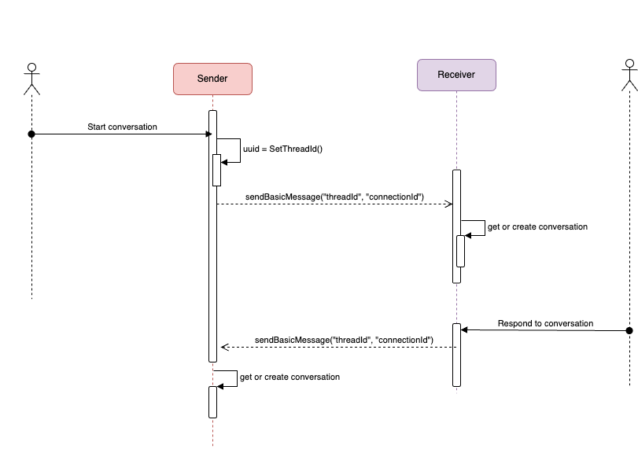

## Motivation

Conversational messaging is a very common interaction between service providers and their customers or community members. Conversations are typically exchanged around a specific context and are often short-lived. Examples of a context-driven conversation include a customer support request or
a request for proof of employment.

## Roles

This protocol reuses the `sender` and `receiver` roles defined in the BasicMessage protocol.

- `sender`: The agent that initiates a new conversation thread.
- `receiver`: The agent that replies with a message to the corresponding conversation thread.

## States

This protocol follows the request-response message exchange pattern, and only requires the simple state of producing a conversational message and waiting for a response.

## Basic Walkthrough

The basic premise for a conversational message protocol is that there is an expectation of at least one response message from the connected peer.  Conversations are constructed based on a parent `ThreadId`, 
if the inbound message includes a `parentThreadId` message decorator, it means it is to be processed as part of a conversation/thread.



## Design By Contract

## Security

## Composition

## Message Reference

This protocol implements the DIDComm basic message protocol, but defines explicit use of the DIDComm `~thread` [message decorator](https://github.com/hyperledger/aries-rfcs/blob/main/concepts/0008-message-id-and-threading/README.md) to correlate the conversation/thread.

### Conversation

Description of the fields explicitly required by this protocol:

-  `@id`: (required) unique id for each message in a conversation/thread
- `~thread`: (required) object containing details of the conversation/thread. Note this decorator is only applicable to DIDComm V1 messaging.
  -  `pthid`: (required) Parent thread identifier. If the message is a child of a conversation thread the pthid will uniquely identify which thread is the parent.
  -  `thid`: (optional) Message thread identifier. Use of this field denotes that a message request/response pair can be grouped within the larger context of a conversation/thread.
  -  `goal_code`: (optional) In case this protocol needs to explictly qualify the intent to process messages by conversation/thread, perhaps we can define the value `conversation`. This is presented as an option compared to defining an entirely new `message_type` (for example, "https://didcomm.org/basicmessage/1.0/conversation" or https://didcomm.org/basicmessage/2.0/conversation)
    

DIDComm v1 example: 

```json
{
    "message": {
        "@type": "https://didcomm.org/basicmessage/1.0/message",
        "@id": "c34d8409-b139-44d9-820c-3cd4107991cb",
        "sent_time": "2024-04-25T17:31:23.880Z",
        "content": "This is the start of a new conversation.",
        "~l10n": {
            "locale": "en"
        },
        "~thread": {
            "pthid": "b8ad23de-d5df-49ae-90a2-c60b5f211854"
        }
    },
    "connectionId": "cca57e83-ec4d-4843-b540-7558738a1886"
}
```

DIDComm v2 example: 

```json
{
  "id": "e79618aa-ccc9-4f0a-a7ac-0a007e5c9ae7",
  "typ": "application/didcomm-plain+json",
  "type": "https://didcomm.org/basicmessage/2.0/message",
  "body": {
    "content": "This is the start of a new conversation."
  },
  "from": "did:peer:2.Vz6MkmtJnKU38J3KKrj1WbkyznVACZ9jzXGb2EomNy59bFtRP...",
  "to": [
    "did:peer:2.Vz6Mkfq1Rq6NS9RP3jJ3PAp9ExzixgWyHuQevTT13j4xTXEex.Ez6LSmWDERZua99gddWgqbCGxyPQKTW2Bf6GbxxkChx8ppT5L..."
  ],
  "lang": "en",
  "created_time": 1714072961386,
  "pthid": "b8ad23de-d5df-49ae-90a2-c60b5f211854"
}
```

## Advanced Walkthroughs

## Collateral

## L10n

## Implementations

## Endnotes

#### 1

#### 2