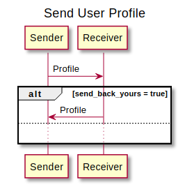
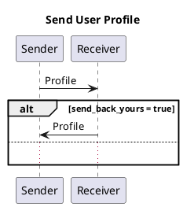

## Summary

A simple protocol for exchanging user profile information between parties.

Data exposed and exchanged within this protocol can be seen as a complement to the basic and untrusted connection information exchanged in Out-of-Band Invitation messages.

## Motivation

Modern communication applications normally need some user-friendly information about the other party. For that purpose it's needed to provide a common mechanism to sharing and retrieving user profile information, which might change over time, in more secure and efficient way than the usual Invitation messages.

## Roles

There are two roles in this protocol:

- `sender` - The agent that is sending their user profile
- `receiver` - The agent that is receiving the user profile from another one
 
## Basic Walkthrough

Exchanges within this protocol involve a single message when an agent wants to share their profile (or any update to it) without asking for other party profile; two messages might be exchanged in case of `Request Profile` or `Profile` with `send_back_yours` enabled.


<!--

-->

## States

As of current specification, no particular state transitions are defined.

## Message Reference

This section explains the structure of the different messages defined for this protocol.

### Profile

This message is used to send user profile to another party.

Description of the fields:

- `profile`: Object containing all supported fields that must be set or updated. Any absent field means that there is no change on that field so the recipient must keep the previous value for this connection. When a field previously present needs to be removed, it must be explicitly set to null or an empty string (e.g. `{ "displayPicture": null }``).
  - `displayName`: String containing user display name in the language specified by localization
  - `displayPicture`:  Reference to an appended attachment which might contain a link to download the picture or an embedded base64 picture. It can also contain a message to retrieve the file through [Media Sharing protocol](https://didcomm.org/media-sharing/1.0)
  - `description`: free text containing user's bio
- `send_back_yours`: When this parameter is defined and set to true, the recipient is expected to send another Profile message containing their profile. Such message should include this message ID as pthid. Agents must not include this parameter when the message is created as a result of another one.

> **Note**: When `send_back_yours` is set, the other party is asked to send their profile. However, it might either choose not to do it or send it in another instance of this protocol. Therefore, the protocol can be considered properly finished as soon as Profile message is successfully sent.  

DIDComm v1 example:

```json
{
    "@id": "8ba049e6-cc46-48fb-bfe0-463084d66324",
    "@type": "<baseuri>/profile",
    "profile": {
        "displayName": "John Doe",
        "displayPicture": "#item1",
        "description": "This is my bio"
    }, 
    "send_back_yours": true,
    "~attach": [{
        "@id": "item1",
        "byte_count": "23894",
        "mime-type": "image/png",
        "filename": "image1.png",
        "data": {
            "links": [ "https://fileserver.com/ref1-uuid" ]
        },
    }]    
}
```

DIDComm v2 example:

```json
{
    "id": "8ba049e6-cc46-48fb-bfe0-463084d66324",
    "type": "<baseuri>/profile",
    "body": {
        "profile": {
            "displayName": "John Doe",
            "displayPicture": "#item1",
            "description": "This is my bio"
        }, 
        "send_back_yours": true,
    },
    "attachments": [{
        "@id": "item1",
        "byte_count": "23894",
        "media_type": "image/png",
        "filename": "image1.png",
        "data": {
            "base64": "iVBORw0KGgoAAAANSUhEUgAAAKsAAADV..."
        },
    }]    
}
```


### Request Profile

This message is used to request a profile. Recipient is expected to send their profile at its current state. This will trigger a new instance of this protocol, uysing Request Profile message's id as `pthid`.

DIDComm v1 example: 

```json
{
    "@id": "8ba049e6-cc46-48fb-bfe0-463084d66324",
    "@type": "<baseuri>/request-profile",
    "query": [ "displayName", "displayPicture", "description" ]
}
```

DIDComm v2 example:

```json
{
    "id": "8ba049e6-cc46-48fb-bfe0-463084d66324",
    "type": "<baseuri>/request-profile",
    "body": {
        "query": [ "displayName", "displayPicture", "description" ]
    }
}
```

`query` parameter is optional and defines which fields the requester is interested in. If no specified, responder must send their full profile.

## Implementations

Current implementations of this protocol are listed below:

Name / Link | Implementation Notes
--- | --- 
[Aries JavaScript User Profile](https://github.com/2060-io/aries-javascript-user-profile) | Initial implementation as an extension module for [Aries Framework JavaScript](https://github.com/hyperledger/aries-framework-javascript). Used in [2060.io](https://2060.io) Mobile Agent and Service Agent.

## Endnotes

### Future Considerations
